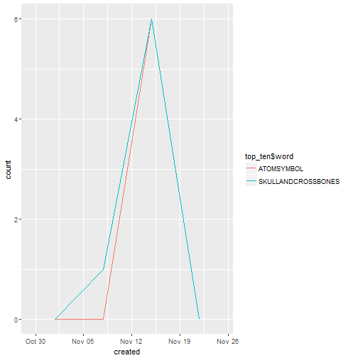
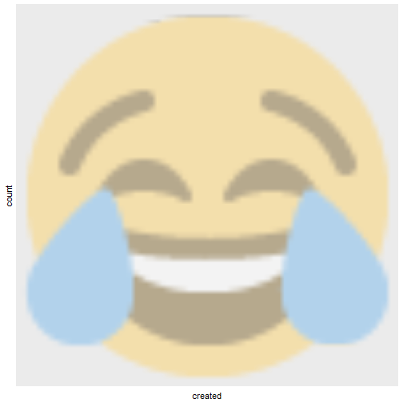
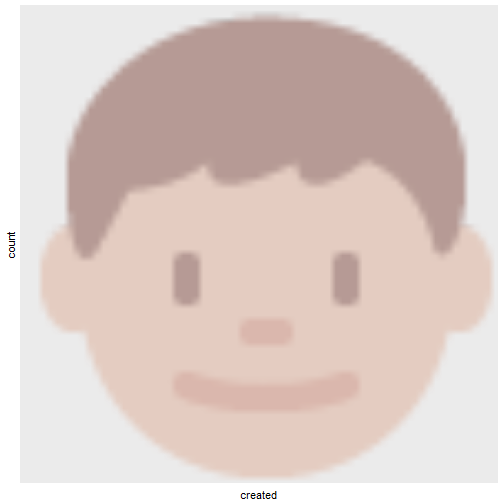
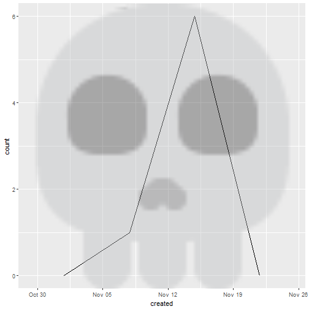
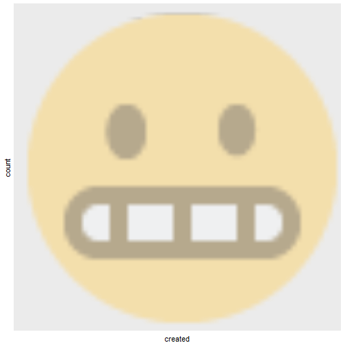

Depending on the video you are exploring, it may be useful to analyze emojis in comments.

Here's how you can do this with YouTube data!

## Getting YouTube Data

I wanted to choose something that had lots of comments containing emojis. So let's look at the comments from the ill-advised and ill-fated Emoji Movie's trailer. The comments about the movie vary a lot in sentiment. Sample this: "The movie is a such disgrace to the animation film industry." <f0><U+009F><U+0092><U+00A9>
```r emo::ji("joy_cat"); emo::ji("joy_cat")```

If you don't know how to access the YouTube API, please see the [instructions here](https://developers.google.com/youtube/v3/).


```r
# Connect to YouTube API
# Leave token blank
# yt_oauth("app_id", "app_password", token='')

# Get comments. 'max_results = 101' ensures I get all of the comments on the video.
emojimovie <- get_comment_threads(c(video_id = "o_nfdzMhmrA"), max_results = 100)

# Save data (if you want)
# save(emojimovie,file=paste("sampletubedata.Rda"))

# If you need to load that data (make sure you are in the right directory)
# load('sampletubedata.Rda')
```

Now we have some (~10,300) comments to play with. Let's identify the emojis in our data. To do that, we'll use the `FindReplace` function from the [DataCombine package](https://cran.r-project.org/web/packages/DataCombine/DataCombine.pdf) and an [emoji dictionary](https://lyons7.github.io/portfolio/2017-10-04-emoji-dictionary/) that I put together. The dictionary has each emoji's prose name, UTF-8 encoding, and R encoding---the R encoding is specifically for emojis in the Twitter data. There are a couple of steps to change the dictionary to be able to identify emojis in YouTube data, but depending on your computer you might be able to just search by UTF-8 encoding. 

[Patrick Perry](https://stackoverflow.com/questions/47243155/get-r-to-keep-utf-8-codepoint-representation/47243425#47243425) helped figure out the emoji encoding issue--- thanks Patrick! <f0><U+009F><U+0098><U+008A>


```r

# change U+1F469 U+200D U+1F467 to \U1F469\U200D\U1F467
emojis <- read.csv(url("https://raw.githubusercontent.com/lyons7/emojidictionary/master/Emoji%20Dictionary%205.0.csv")) 

# Specific to YouTube data
emojis <- emojis[!emojis$Name == " SHRUGFACE ", ]
emojis$escapes <- gsub("[[:space:]]*\\U\\+", "\\\\U", emojis$Codepoint)

# convert to UTF-8 using the R parser
emojis$codes <- sapply(parse(text = paste0("'", emojis$escapes, "'"),
                       keep.source = FALSE), eval)

emojimovie$text <- as.character(emojimovie$textOriginal)

# Go through and identify emojis
emoemo <- FindReplace(data = emojimovie,
                      Var = "text",
                      replaceData = emojis,
                      from = "codes",
                      to = "Name", 
                      exact = FALSE)

# This might take some time, we have a big data set. 
# Save if you want
# save(emoemo, file = "sampletubedataemojis.Rda")
```

Now that you have identified comments with emojis, let's look at the top emojis in our data set.


```r

# Have to do keep the "to_lower" parameter FALSE so our emojis in our dictionary are kept separate from words that happen to be the same as emoji names
emotidy_tube <- emoemo %>%
  unnest_tokens(word, text, to_lower = FALSE)

# Nuke extra spaces
emojis$Name <- gsub("^\\s+|\\s+$", "", emojis$Name)

# Now we will use inner_join to keep matches and get rid of non-matches
tube_emojis_total <- 
emotidy_tube %>%
  inner_join(emojis, by = c("word" = "Name"))

# What is the most frequent emoji?
tube_freqe <- tube_emojis_total %>% 
   count(word, sort = TRUE)

tube_freqe[1:10, ]
#> # A tibble: 10 x 2
#>                    word     n
#>                   <chr> <int>
#>  1 TAGLATINSMALLLETTERE   953
#>  2 TAGLATINSMALLLETTERT   605
#>  3 TAGLATINSMALLLETTERO   599
#>  4 TAGLATINSMALLLETTERI   575
#>  5 TAGLATINSMALLLETTERA   475
#>  6 TAGLATINSMALLLETTERS   453
#>  7 TAGLATINSMALLLETTERH   419
#>  8 TAGLATINSMALLLETTERN   388
#>  9 TAGLATINSMALLLETTERR   321
#> 10 TAGLATINSMALLLETTERL   287
```

So, our ten most frequent emojis in the comments of the Emoji Movie trailer are ``<f0><U+009F><U+0098><U+0082>``, ``<f0><U+009F><U+0091><U+00A6>``, ``<f0><U+009F><U+0093><U+00B1>``, ``<f0><U+009F><U+0098><U+0098>``, ``<f0><U+009F><U+0091><U+00A8>``, ``<U+2620><U+FE0F>``, ``<U+269B><U+FE0F>``, ``<f0><U+009F><U+0091><U+00AF>``, ``<f0><U+009F><U+0098><U+00AC>``, and ``<f0><U+009F><U+0098><U+0099>``. Read into that what you will! ``<f0><U+009F><U+0098><U+0082>``

What if we want to look at how the use of these emojis has changed over time? We can also look at WHEN comments were posted. We can also graph frequency of comments over time. 

Graphs constructed with help from [here](http://www.cyclismo.org/tutorial/R/time.html), [here](https://gist.github.com/stephenturner/3132596),
[here](http://stackoverflow.com/questions/27626915/r-graph-frequency-of-observations-over-time-with-small-value-range), [here](http://michaelbommarito.com/2011/03/12/a-quick-look-at-march11-saudi-tweets/), [here](http://stackoverflow.com/questions/31796744/plot-count-frequency-of-tweets-for-word-by-month), [here](https://stat.ethz.ch/R-manual/R-devel/library/base/html/as.POSIXlt.html), [here](http://sape.inf.usi.ch/quick-reference/ggplot2/geom) and [here](http://stackoverflow.com/questions/3541713/how-to-plot-two-histograms-together-in-r).

We will also use the [anytime](https://cran.r-project.org/web/packages/anytime/index.html) package to format time. 


```r

# Subset to just have posts that have our top ten emojis
top_ten <- subset(tube_emojis_total, word %in% c("FACEWITHTEARSOFJOY", "BOY", "MOBILEPHONE", "FACETHROWINGAKISS", "MAN", "SKULLANDCROSSBONES", "ATOMSYMBOL", "COLONEWOMANWITHBUNNYEARS", "GRIMACINGFACE", "KISSINGFACEWITHSMILINGEYES"))

# Now use the 'anytime' package to convert to time format we can use
top_ten$created <- anytime(as.factor(top_ten$publishedAt))

minutes <- 60

ggplot(top_ten, aes(created, color = top_ten$word)) + 
  geom_freqpoly(binwidth = 10080*minutes)
```



```r

# We can look at these one by one too and use the emoGG package to use actual emojis to show which ones we are talking about 
# The code you use in emoGG is the same as UTF-8 but without "U+" etc, and all letters lowercase

tearsofjoy <- top_ten[top_ten$word == "FACEWITHTEARSOFJOY", ]

ggplot(tearsofjoy, aes(created)) + 
  geom_freqpoly(binwidth = 10080*minutes) +
  add_emoji(emoji = "1f602")
```



```r

boy <- top_ten[top_ten$word == "BOY",]
ggplot(boy, aes(created)) + 
  geom_freqpoly(binwidth = 10080*minutes) +
  add_emoji(emoji = "1f466")
```



```r

boy <- top_ten[top_ten$word == "BOY",]
ggplot(boy, aes(created)) + 
  geom_freqpoly(binwidth = 10080*minutes) +
  add_emoji(emoji = "1f466")
```


```r

# Sometimes emoGG doesn't have your emoji -- here we have to use skull, not skull and crossbones
skull <- top_ten[top_ten$word == "SKULLANDCROSSBONES",]
ggplot(skull, aes(created)) + 
  geom_freqpoly(binwidth = 10080*minutes) + add_emoji(emoji = "1f480")
```



```r

grimace <- top_ten[top_ten$word == "GRIMACINGFACE",]
ggplot(grimace, aes(created)) + 
  geom_freqpoly(binwidth = 10080*minutes) + add_emoji(emoji = "1f62c")
```



```r

# ad infinitum!
```
